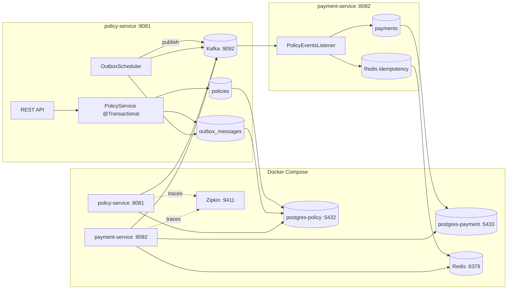
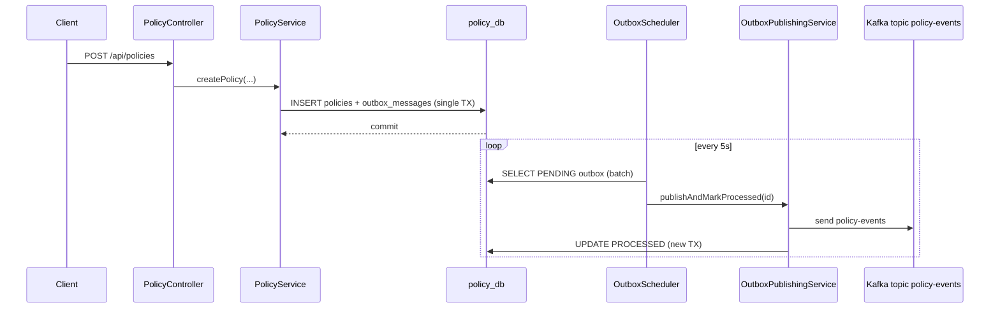
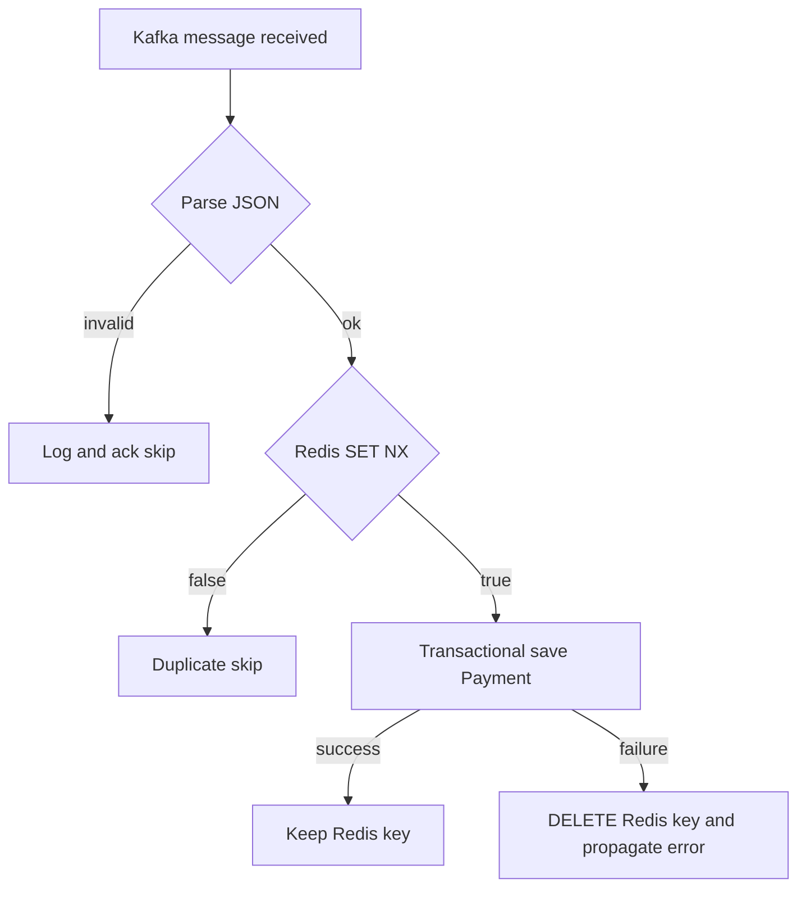

# Distributed Insurance System — Microservices with Transactional Outbox

[](https://openjdk.org/)
[](https://spring.io/projects/spring-boot)
[](https://maven.apache.org/)
[](https://kafka.apache.org/)
[](https://www.postgresql.org/)
[](https://redis.io/)
[](https://docs.docker.com/compose/)

[](https://github.com/LaliFefer/Distributed-Insurance-System)

Reference implementation of a **policy → payment** flow using the **Transactional Outbox Pattern**, **Apache Kafka**, **separate PostgreSQL databases**, and **Redis-backed idempotency** on the consumer. **Docker Compose** can run infrastructure **and** both Spring Boot services on ports **8081** / **8082**.

---

## Quick start (Docker)

From the **repository root**:

```bash
cp .env.example .env   # optional: tune passwords/ports
docker compose up --build -d
```

- **Policy API:** [http://localhost:8081/swagger-ui.html](http://localhost:8081/swagger-ui.html)  
- **Payment API:** [http://localhost:8082/swagger-ui.html](http://localhost:8082/swagger-ui.html)  
- **Zipkin:** [http://localhost:9411](http://localhost:9411)  

Rebuild without cache before a release demo:

```bash
docker compose build --no-cache
docker compose up -d
```

---

## Table of contents

- [Architecture overview](#architecture-overview)
- [Design patterns & engineering principles](#design-patterns--engineering-principles)
- [Transactional outbox pattern](#transactional-outbox-pattern)
- [Idempotency and resilience](#idempotency-and-resilience)
- [Production-ready features](#production-ready-features)
- [Tech stack](#tech-stack)
- [Repository layout](#repository-layout)
- [How to run](#how-to-run)
- [API example](#api-example)
- [Observability](#observability)
- [CI/CD](#cicd)
- [Publishing to GitHub & container images](#publishing-to-github--container-images)

---

## Production-ready features

### Global API errors

Both services expose a **`@RestControllerAdvice`** that returns a consistent JSON body on failures:

`timestamp`, `status`, `error`, `message`, `path`

Validation errors return **400**; duplicate policy numbers return **409**; unexpected errors return **500** with a generic message (details logged server-side).

### Validation

`CreatePolicyRequest` uses **`@NotBlank`**, **`@DecimalMin`**, and **`@Min`**; **`POST /api/policies`** uses **`@Valid`**. **`payment-service`** includes **`spring-boot-starter-validation`** for future REST DTOs.

### Logging

Services use **SLF4J via Lombok `@Slf4j`**: **INFO** for request/outbox/Kafka flow, **WARN** for publish retries and Redis idempotency hits, **ERROR** for invalid payloads and unhandled exceptions. **`application.yml`** caps noisy **`org.apache.kafka`** / **`org.springframework.kafka`** client logs to **WARN** and **`NetworkClient`** to **ERROR** so Docker logs stay readable while Kafka finishes starting.

### Integration test (transactional outbox)

**`PolicyTransactionalOutboxIntegrationTest`** loads the Spring context with **`PolicyRepository`** mocked to throw on **`save`**. It asserts **`OutboxRepository`** has **no rows**—so the outbox is never written when policy persistence fails, matching the **`@Transactional`** orchestration contract.

---

## Architecture overview

This repository is a **multi-module Maven** project: a shared **`common`** library plus two deployable Spring Boot services (**`policy-service`**, **`payment-service`**). That layout keeps domain contracts (e.g. `PolicyCreatedEvent`) in one place while allowing independent build, test, and deployment boundaries—typical for teams that want clear API ownership without a monolith.

| Choice | Rationale |
|--------|-----------|
| **Java 21** | Virtual threads–ready LTS baseline, aligned with modern Spring Boot 3.x. |
| **Spring Boot 3.3** | Mature ecosystem for JPA, Kafka, Redis, and production operations. |
| **Separate PostgreSQL instances** | **`policy_db`** on host port **5432** and **`payment_db`** on **5433** enforce **loose coupling** at the persistence boundary: no shared schema, no cross-service FKs, and each service owns its migrations and scaling story. |



---

## Transactional outbox pattern

### The dual-write problem

If an application **writes to the database** and then **publishes to Kafka** as two separate steps (or the reverse), a failure between the two causes **inconsistency**:

- DB committed, message never published → downstream never runs.
- Message published, DB rolled back → **ghost events** and inconsistent state.

Both are hard to reason about under retries and partial failures.

### How this project solves it

1. **Single atomic transaction**  
   `PolicyService#createPolicy` is annotated with `@Transactional`. In one transaction it persists:
   - the **`Policy`** row, and  
   - a **`OutboxMessage`** row (`PENDING`) whose `payload` is the serialized **`PolicyCreatedEvent`**.

   Either both rows commit or neither does—**no dual write across different systems in the same business operation**.

2. **Asynchronous relay to Kafka**  
   `OutboxScheduler` runs on a fixed interval (default **5 seconds**), loads pending outbox rows, and delegates to `OutboxPublishingService`, which:
   - publishes to the **`policy-events`** topic (key = event UUID, value = JSON payload), then  
   - marks the row **`PROCESSED`** in a separate transaction (`REQUIRES_NEW`) so publish and mark are isolated from the scheduler’s transaction boundary.

3. **At-least-once delivery**  
   Kafka and the scheduler semantics are **at-least-once**: the same logical event could theoretically be delivered more than once (e.g. crash after send but before `PROCESSED`, or redelivery). That is why **consumers must be idempotent**—see the next section.



---

## Idempotency and resilience

**`payment-service`** consumes **`policy-events`**. Before persisting a **`Payment`**, it uses Redis:

```text
SET policy-event:{eventId} 1 NX EX <TTL>
```

- **`SET` … `NX`** succeeds only if the key did not exist → **first consumer wins**; duplicates exit early without inserting another payment.
- **TTL** (default **7 days**) bounds memory use while still covering typical redelivery windows.
- If the database write fails after the Redis claim, the listener **deletes the key** so a retry can process again.

A **unique constraint on `event_id`** in `payments` provides a second line of defense against duplicates under races or Redis loss.



---

## Tech stack

| Layer | Technology |
|--------|------------|
| Language | **Java 21** |
| Framework | **Spring Boot 3.3** |
| Persistence | **Spring Data JPA**, **Hibernate**, **PostgreSQL 16** |
| Messaging | **Spring for Apache Kafka**, **Kafka (KRaft)** |
| Idempotency | **Spring Data Redis**, **Redis 7** |
| Packaging / build | **Maven** (wrapper targets **Maven 3.9.6**) |
| Infrastructure | **Docker Compose** (Postgres ×2, Kafka, Redis, Zipkin) |
| API docs | **SpringDoc OpenAPI 2.5** (Swagger UI) |
| CI | **GitHub Actions** — `mvn clean compile` on push to `main` |
| UI (optional) | **React 18**, **Vite**, **TanStack Query**, **Tailwind** — `monitoring-ui/` |

---

## Design patterns & engineering principles

| Theme | How it shows up in this repo |
|--------|------------------------------|
| **SOLID** | Small services with focused packages (`web`, `service`, `domain`, `kafka`); controllers delegate to services; consumer logic isolated in listeners. |
| **Clean boundaries** | **Multi-module Maven**: shared **`common`** events only; no cross-DB access; each service owns its schema and ports. |
| **Event-driven architecture (EDA)** | **Transactional outbox** → **Kafka** topic `policy-events` → **payment-service** consumer; async coupling without dual writes. |
| **Resilience** | **Redis idempotency** (`SET NX`) + **DB unique constraint** on `event_id`; at-least-once Kafka semantics acknowledged in design. |
| **Observability** | **Micrometer + Zipkin** tracing, **Spring Boot Actuator** health, structured logging with **SLF4J**. |

---

## Repository layout

```text
insurance-system/
├── .github/workflows/         # CI (Maven compile on push to main)
├── .env.example               # Template for Compose env (copy to .env; never commit .env)
├── common/                    # Shared event DTOs (e.g. PolicyCreatedEvent)
├── policy-service/            # REST, outbox, scheduler, Kafka producer, Dockerfile
├── payment-service/           # Kafka consumer, Redis idempotency, Dockerfile
├── scripts/                   # Optional PowerShell helpers (build / run)
├── monitoring-ui/             # React 18 + Vite dashboard (see monitoring-ui/README.md)
├── docker-compose.yml         # Postgres ×2, Kafka, Redis, Zipkin, both apps
├── mvnw, mvnw.cmd             # Maven Wrapper
└── pom.xml                    # Parent aggregator
```

---

## How to run

### Prerequisites

- **JDK 21** (for local Maven runs) and **`JAVA_HOME`** set on Windows when using `mvnw.cmd`.
- **Docker Desktop** (or compatible engine) for Compose.

### Option A — Full stack with Docker Compose (recommended)

From the **repository root**, build images and start everything (databases, Kafka, Redis, Zipkin, **policy-service**, **payment-service**):

```bash
docker compose up --build -d
```

- **Policy API & Swagger:** [http://localhost:8081/swagger-ui.html](http://localhost:8081/swagger-ui.html)
- **Payment Swagger:** [http://localhost:8082/swagger-ui.html](http://localhost:8082/swagger-ui.html)
- **OpenAPI JSON:** `/v3/api-docs` on each port

Services use **Docker network DNS** (`postgres-policy`, `postgres-payment`, `kafka:29092`, `redis`). Copy **`.env.example`** to **`.env`** to override credentials, ports, and image coordinates. Default **`image:`** values point at **GHCR** (`ghcr.io/<owner>/policy-service:latest` and `payment-service:latest`) matching **[`.github/workflows/deploy.yml`](.github/workflows/deploy.yml)**—set **`GHCR_IMAGE_OWNER`** in **`.env`** to your GitHub username or org (**lowercase**, e.g. `lalifefer`). For **`docker compose pull`** without building locally, log in with **`echo $GITHUB_TOKEN | docker login ghcr.io -u USER --password-stdin`** or make the packages **public** in GitHub → **Packages** → package settings.

**Note:** First **`docker compose build`** runs **Maven inside the Dockerfile** (multi-stage); it can take several minutes. CI builds the same Dockerfiles on every push to **`main`** and pushes **`latest`** to **GHCR**.

### Option B — Infrastructure only in Docker, apps on the host

1. **Start data plane only** (if your `docker-compose.yml` includes app services, use profiles or run infra services selectively). For this repo, you can start dependencies and skip app containers by scaling them to zero, or stop `policy-service` / `payment-service` after `up` if you prefer local JVMs:

   ```bash
   docker compose up -d postgres-policy postgres-payment kafka redis zipkin
   ```

2. **Build** (from repo root):

   ```bash
   ./mvnw clean install
   ```

   Windows PowerShell (dynamic `JAVA_HOME` from `java` on `PATH`):

   ```powershell
   $javaExe = (Get-Command java -ErrorAction Stop).Source; $env:JAVA_HOME = Split-Path (Split-Path $javaExe); .\mvnw.cmd clean install -DskipTests
   ```

   Or **`.\scripts\sync-build.ps1`**.

3. **Run both apps** in two terminals (uses `localhost` URLs from `application.yml`):

   ```bash
   ./mvnw -pl policy-service spring-boot:run
   ./mvnw -pl payment-service spring-boot:run
   ```

   Parallel helpers: **`.\scripts\run-policy-service.ps1`** and **`.\scripts\run-payment-service.ps1`**.

Default DB user/password match **`application.yml`** (`insurance` / `changeme`). Kafka from the host uses **`localhost:9092`**; from containers use **`kafka:29092`** (already set in Compose for the apps).

### Monitoring dashboard (React)

```bash
cd monitoring-ui && npm install && npm run dev
```

Requires **policy-service** on **8081** and **payment-service** on **8082** (or adjust Vite `server.proxy` in `monitoring-ui/vite.config.ts`).

### Tests

```bash
./mvnw test
```

Includes **`PolicyTransactionalOutboxIntegrationTest`** (outbox consistency when policy save fails).

---

## API example

Create a policy (persists policy + outbox row; Kafka publish happens on the scheduler tick).

**`curl` (bash / Git Bash on Windows):**

```bash
curl -s -X POST "http://localhost:8081/api/policies" \
  -H "Content-Type: application/json" \
  -d '{"policyNumber":"POL-10042","amount":1250.50,"customerId":9001}'
```

**JSON body:**

```json
{
  "policyNumber": "POL-10042",
  "amount": 1250.50,
  "customerId": 9001
}
```

**Expected:** `201 Created` with a JSON body representing the saved **`Policy`** (including generated `id`). Within the configured poll interval, the outbox row should move to **`PROCESSED`** and a matching **`Payment`** row should appear in **`payment_db`** (and a Redis key `policy-event:{uuid}` for the event id).

**Swagger UI:** `http://localhost:8081/swagger-ui.html` (policy) · `http://localhost:8082/swagger-ui.html` (payment)

---

## CI/CD

### Maven compile (PRs and pushes)

Workflow: **`.github/workflows/maven-build.yml`**

- Triggers on **push** and **pull_request** to **`main`**
- Uses **Temurin JDK 21** and **`./mvnw -B clean compile`**

### Docker images → GHCR (push to `main` only)

Workflow: **`.github/workflows/deploy.yml`**

- On every **push to `main`**, logs in to **GitHub Container Registry** with **`secrets.GITHUB_TOKEN`**, then builds and pushes:
  - **`ghcr.io/<repository-owner-lowercase>/policy-service:latest`**
  - **`ghcr.io/<repository-owner-lowercase>/payment-service:latest`**
- Uses the same **multi-stage Dockerfiles** as local **`docker compose build`**. The repository owner is **lowercased** in tags because Docker requires lowercase image names.

Ensure **Actions** has permission to write packages (default for `GITHUB_TOKEN` in `deploy.yml` includes **`packages: write`**).

---

## Observability

- **Actuator:** `GET http://localhost:8081/actuator/health` and `http://localhost:8082/actuator/health`
- **Zipkin UI:** `http://localhost:9411` (tracing export configured in both `application.yml` files when infrastructure is up)

---

## Publishing to GitHub & container images

### GitHub repository

Source of truth for issues and PRs: **[LaliFefer/Distributed-Insurance-System](https://github.com/LaliFefer/Distributed-Insurance-System)** on GitHub.

### GHCR (automated)

After you push to **`main`**, **[`.github/workflows/deploy.yml`](.github/workflows/deploy.yml)** publishes **`policy-service`** and **`payment-service`** images to **GHCR** with the **`latest`** tag. Pull them (replace owner if needed):

```bash
docker pull ghcr.io/lalifefer/policy-service:latest
docker pull ghcr.io/lalifefer/payment-service:latest
```

To run the stack using pre-built images only (no local build), use the default **`image:`** lines in **`docker-compose.yml`** and run **`docker compose pull`** then **`docker compose up -d`** (omit **`--build`** unless you change code).

### Manual Git push

1. Initialize or use your existing Git repository, then push to GitHub:

   ```bash
   git add .
   git status
   git commit -m "Production-ready microservices: outbox, Kafka, Zipkin, GHCR CI"
   git remote add origin https://github.com/LaliFefer/Distributed-Insurance-System.git   # if not set
   git branch -M main
   git push -u origin main
   ```

2. **Optional — Docker Hub or extra tags** (only if you also publish outside GHCR):

   ```bash
   docker tag ghcr.io/lalifefer/policy-service:latest myuser/policy-service:latest
   docker push myuser/policy-service:latest
   ```

   Prefer **`GHCR_IMAGE_OWNER`** in **`.env`** so **`docker compose build`** tags align with your GHCR namespace.

---

## License

Proprietary / internal — adjust as appropriate for your organization.
